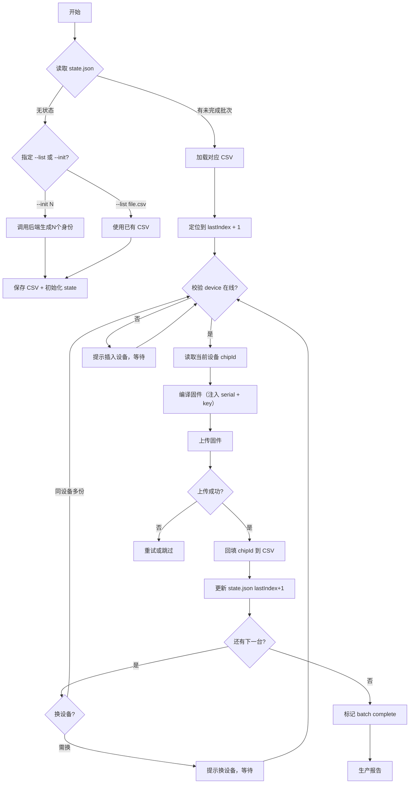

# 量产烧录方案设计

> 本文档记录 P008 环境监测系统 ESP8266 固件的量产烧录方案。
> 核心原则：**零人工输入、可追溯、防重复、支持扩产**。

---

## 总体架构

```
┌─────────────────────────────────────────────────────────┐
│                    前端（PC / 烧录工位）                   │
│                                                         │
│  CSV清单 ──→ 批量烧录脚本(bulk-flash.py) ──→ PlatformIO  │
│                      ↓                                  │
│              状态文件(state.json)                        │
│              烧录日志(burn-log.csv)                      │
└─────────────────────────────────────────────────────────┘
                            │
                            ▼
                    ESP8266 设备 (×N)
```

---

## 一、设备身份管理（后端）

### 1.1 身份清单生成

后端提供管理员 API，一键预生成设备身份：

```
POST /api/v1/admin/devices/batch-create
{
  "prefix": "DHT22",
  "count": 1000,
  "sceneType": "temperature_humidity"
}
```

返回 CSV 文件 `devices-20260601.csv`：

```csv
idx,serial,device_key,chip_id_mark,scene_type,created_at
1,DHT22-8A3F2,A3F2B71C...,,temperature_humidity,2026-06-01T10:00:00Z
2,DHT22-B71C9,B71C9A3F...,,temperature_humidity,2026-06-01T10:00:00Z
...
```

- **idx**：序号（从1开始）
- **serial**：序列号（固定前缀 + 递增 hex 或随机 hex）
- **device_key**：随机 32 位 hex 密钥
- **chip_id_mark**：烧录后回填，用于追溯
- **scene_type**：场景类型（决定固件配置）

### 1.2 身份约束

- 序列号全局唯一（数据库 UNIQUE 约束）
- 密钥长度 ≥ 16 位（量产用 32 位）
- 一机一密，永不重复

---

## 二、烧录脚本设计

### 2.1 脚本定位

`hardware/esp8266-sensor/scripts/bulk-flash.py`

- 独立于 PlatformIO，不依赖 VS Code
- 兼容 Windows / macOS / Linux
- 单文件，依赖：Python 3.8+、pyserial、已安装 PlatformIO CLI

### 2.2 核心工作流



### 2.3 命令行接口

```bash
# ① 初始化和生成
python bulk-flash.py --init 1000 --prefix DHT22 --scene temperature_humidity

# ② 使用已有 CSV 烧录（继续进度）
python bulk-flash.py --list devices-20260501.csv

# ③ 重置进度（重新烧录）
python bulk-flash.py --list devices-20260501.csv --reset

# ④ 查看当前状态
python bulk-flash.py --status

# ⑤ 导出烧录报告
python bulk-flash.py --report
```

### 2.4 状态文件

`scripts/state.json`：

```json
{
  "batchId": "B20260601-001",
  "csvFile": "devices-20260601.csv",
  "total": 1000,
  "lastIndex": 128,
  "completed": false,
  "createdAt": "2026-06-01T10:00:00Z",
  "sceneType": "temperature_humidity",
  "board": "nodemcuv2",
  "envName": "nodemcuv3-dht22"
}
```

### 2.5 烧录日志

`logs/burn-YYYYMMDD-HHMMSS.csv`：

```csv
timestamp,idx,serial,chip_id,result,error_msg,duration_s
2026-06-01 10:01:23,1,DHT22-8A3F2,12345678,SUCCESS,,12.5
2026-06-01 10:01:41,2,DHT22-B71C9,23456789,FAILED,upload timeout,30.0
2026-06-01 10:02:15,3,DHT22-4DE12,34567890,SUCCESS,,13.2
```

---

## 三、固件编译注入

### 3.1 方式一：build_flags 注入（推荐）

```bash
pio run -e nodemcuv3-dht22 -t upload \
  --build-flags "-DDEVICE_SERIAL='DHT22-8A3F2' -DDEVICE_KEY='A3F2B71C...'"
```

- 优点：不改任何文件，纯命令行
- 缺点：PlatformIO 原生不支持 `--build-flags`，需要修改脚本

### 3.2 方式二：临时配置注入（可行）

1. 读取 CSV 当前行
2. 生成临时 `config.local.h`，覆盖 `DEVICE_SERIAL` 和 `DEVICE_KEY`
3. 编译
4. 删除临时文件

```bash
# 脚本内实现
echo "#define DEVICE_SERIAL \"DHT22-8A3F2\"" > include/config.local.h
echo "#define DEVICE_KEY \"A3F2B71C...\"" >> include/config.local.h
pio run -e nodemcuv3-dht22 -t upload
rm include/config.local.h
```

### 3.3 方式三：Python 直接替换编译标志

用 PlatformIO Python API 直接修改 build_flags，最干净。

---

## 四、可追溯性

### 4.1 烧录后

- CSV 中 `chip_id_mark` 字段回填实际 chipId
- 烧录日志记录时间、结果、耗时
- 设备首次上报时，后端比对 chipId 是否与 CSV 记录一致

### 4.2 生产报告

脚本可以输出：
- ✅ 成功烧录：X 台
- ❌ 失败：Y 台（原因分布）
- ⏱ 平均烧录时间
- 📋 未烧录清单

---

## 五、分工边界

| 谁做 | 做什么 |
|------|--------|
| **后端（旺财）** | 批量生成身份 API、CSV 导出、chipId 回填接口 |
| **烧录脚本（待开发）** | 解析 CSV、注入编译、上传、进度管理、日志 |
| **烧录工位（潘哥/生产）** | 插设备、运行命令、看指示灯、换设备 |

---

## 六、扩产准备

- CSV 可追加：同一批次烧完后再加新设备，`--append devices-20260601-extra.csv`
- 多工位并行：每个工位独立的 `state.json` 和 CSV 子集
- 多场景支持：同一个脚本支持不同 `envName`
- 离线模式：CSV 可纯本地生成（无需后端），适用于开发阶段

---

## 待定项

1. ~~**序列号生成方式**~~ → **已确定：设备 MAC 地址后 12 位 hex**
2. ~~**密钥长度**~~ → **已确定：chipId HMAC-SHA256（HMAC secret 写在固件中）**
3. ~~**编译注入方式**~~ → **已确定：不需要注入，设备自生成**
4. **chipId 回填时机**：烧录前读 vs 烧录后读
5. **多工位并行方案**：是否需要
6. **脱机烧录器方案**：是否要支持

---

## 身份生成方案（2026-05-01 确定）

### 序列号

**格式**：`{场景前缀}-{MAC地址后12位hex}`

示例：`DHT22-48E7DAA3F2B7`

- MAC 地址全球唯一，不存在重复可能
- ESP8266 原生支持 `WiFi.macAddress()`，零额外依赖
- 中横线分隔，默认全大写

### 密钥

**算法**：HMAC-SHA256(chipId, HW_SECRET)

- `chipId` = `ESP.getChipId()`（32 位整数）
- `HW_SECRET` = 编译时写入固件的固定密钥（如 `"P008-HW-SECRET-2026"`）
- 输出取前 32 位 hex 作为设备密钥

**优点**：
- 一机一密，拆机只影响单台
- 后端不需要存储密钥，只要有 `HW_SECRET` 就能校验
- 序列号用 MAC 不可预测，无法冒名

### 安全性评估

| 威胁 | 风险 | 防护 |
|------|------|------|
| 拆机读 flash | 暴露 HW_SECRET → 可伪造任意设备 | ❌ 无法防，但攻击者需要物理接触每台设备 |
| 重放攻击 | 录下 HTTP 请求重放 | ⚠️ 可通过 timestamp + nonce 防（后期再加） |
| 中间人攻击 | HTTPS 被篡改 | ✅ 已有 HTTPS |

### 未来升级方向

| 时机 | 可升级项 |
|------|---------|
| 设备量 1000+ | 更换更强的 HW_SECRET，批量远程更新 |
| 有客户要求更高安全 | 引入 timestamp + nonce 防重放 |
| 设备支持 OTA | 可远程升级验证逻辑 |
| 企业客户 | 每客户独立 HW_SECRET，支持证书认证 |

**设计原则**：验证逻辑可扩展，新老版本共存，不强制升级。
